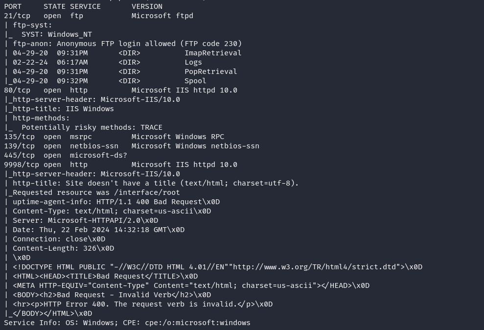
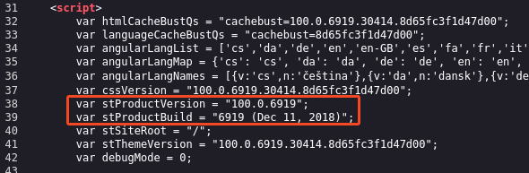
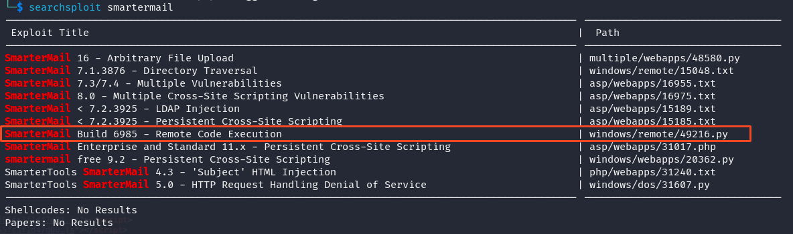
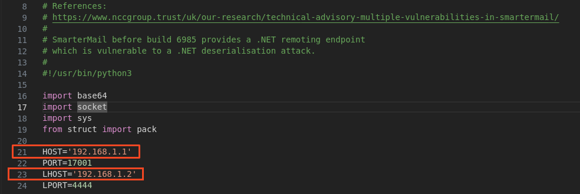
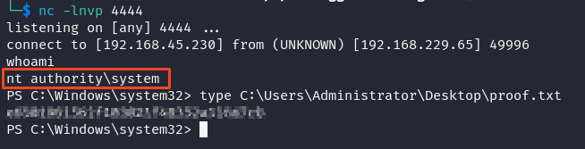

# Recon
## Nmap
```
nmap -sC -sV 192.168.229.65
```


From the nmap scan, we can look at the http servers first which are on ports 80 and 9998.
- port 80 is a default IIS page
- port 9998 shows a SmarterMail log in page

Looking at the page source, we can find the version number of SmarterMail


## Searchsploit
Looking for a exploit for SmarterMail shows the following results


The most promising result is the remote code execution for build 6985
```
searchsploit -m windows/remote/49216.py
```

The script begins with the following


The script states that
- there is a .NET endpoint on port 17001
- change the target IP to match algernon and host IP to match our kali machine
- start a listener, then run the script
```
python 49216.py
```



# Summary

This script is an exploit for a vulnerability in SmarterMail before build 6985, identified as CVE-2019-7214. The vulnerability involves a .NET remoting endpoint that is susceptible to a .NET deserialization attack. The script leverages this vulnerability to achieve remote code execution on the target system. It sets up a payload that establishes a reverse TCP shell to a specified host and port. The exploit author provides a PowerShell payload encoded in Base64, which is injected into the vulnerable endpoint to execute arbitrary commands on the target system. The script connects to the target IP and port, sends the exploit payload, and then closes the connection.

Join me for the next machine soon for more exciting challenges and security insights!

+10 points