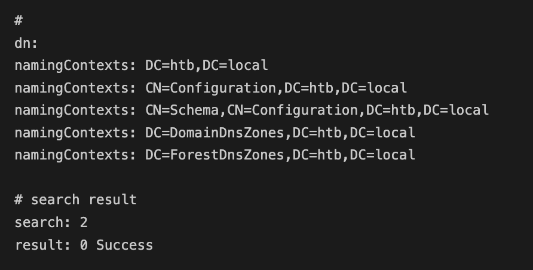
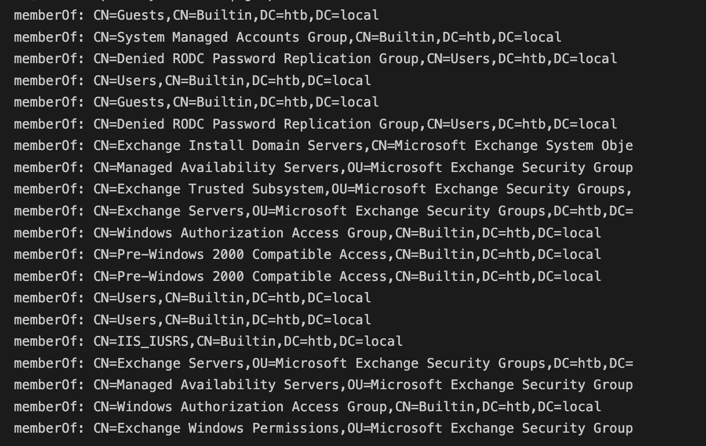
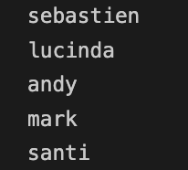

# Recon
## Nmap

```
nmap -v -A -oA nmap/forest 10.10.10.161
```

## Ping
```
ping 10.10.10.161
```

Ping tool suggests the box is windows as it has a ttl of 127.

### Standard TTLs
- Linux default ttl is 64
- Windows default ttl is 128 (-1 for router)
- Routers or network devices are 255 (usually above 128)

## DNS
```
nslookup 
> server 10.10.10.161
> 127.0.0.1
> 127.0.0.2
> 10.10.10.161

```

Maybe some DNS recursion or some issue which is stopping us from getting hostname

## Ports/Services

#### 445
Usually used for Microsoft Directory Services for Active Directory and for **Server Message Block (SMB)** protocol over TCP/IP

##### smb
Host script results shows that it is running smb

Let's try smbclient first using -L flag

`-L` This option allows you to look at what services are available on a server. You use it as smbclient -L host and a list should appear. The -I option may be useful if your NetBIOS names don't match your TCP/IP DNS host names or if you are trying to reach a host on another network.
```
smbclient -L 10.10.10.161
```
Looks like nothing is available

#### LDAP - getting users and password spraying
LDAP seems like another service with a decent attack surface

We can get the DN (domain name) from using `ldapsearch` (namingContexts)
- the machine [[Ypuffy]] explains this better
```
ldapsearch -x -s base -H ldap://10.10.10.161
```
- `-x`: Use simple authentication instead of SASL.
- `-s`: `base`|one|sub|children

Specify the scope of the search to be one of:
- `base`, `one`, `sub`, or `children` to specify a base object, one-level, subtree, or children search. 
- The default is `sub`. 

Note: _children_ scope requires LDAPv3 subordinate feature extension

From the command, we now know the base domain name to be `DC=htb,DC=local`
- `-b` basedn, basedn for search
- `DC` = domain component



```
ldapsearch -H ldap://10.10.10.161 -x -b "DC=htb,DC=local" > ldap-anonymous.out
```

This includes all the LDAP information that we can query
- we can get the groups by grep for memberof
```
cat ldap-anonymous.out | grep -i memberof
```



The followind command will dump only the things that have the objectClass as Person
```
ldasearch -H ldap://10.10.10.161 -x -b "DC=htb,DC=local" '(objectClass=Person)'
```

From this we notice that the account name is sAMAccountName so we can apply a filter to ldapsearch
`ldapsearch -H ldap://10.10.10.161 -x -b "DC=htb,DC=local" '(objectClass=Person)' sAMAccountName | grep sAMAccountName > ldap-account-name.out`

`cat ldap-account-name.out`


As we can see there are users called sebastien, lucinda, andy, mark and santi. There are also other accounts:
- `Guest` cannot be bruteforced
- anything with $ at the end, like `FOREST$` and `EXCH01$` is generated by AD as a machine account and the password cannot be cracked
- then the rest are generated by exchange and won't be cracked
- left with the last 5 entries

##### Format
We only need these account names so lets awk $2 and delete everything before sebastien manually.
```
cat ldap-account-name.out | awk '{print $2}' > accounts.out
```


# Tools

## CRACKMAPEXEC

Using crackmapexec we can dump the password policy of Active Directory using a null authentication, then doing a password spray since we now have a better idea of what the password looks like

Null authentication request with null username and password
```
crackmapexec smb 10.10.10.161 --pass-pol -u '' -p ''
```
- Using the option **--pass-pol** you can get the password policy of the domain

## Enum4Linux (also gives password policy)

We'll run enum4linux which is a tool for enumerating information from Windows and Samba systems. It’s a wrapper around the **Samba tools smbclient, rpclient, net and nmblookup**. With special configuration, you can even have it query **LDAP**

**Check for null and Guest access on smb services** (this won't work on modern Windows versions), it only works on Windows systems that have been upgraded from older versions as this was required in older versions

```
enum4linux -a -u "" -p "" 10.10.10.161 && enum4linux -a -u "guest" -p "" 10.10.10.161
```

Using this tool  a user that we did not have before from ldapsearch can be seen called `svc-alfresco`
Add this user to the userlist we made before password spraying 